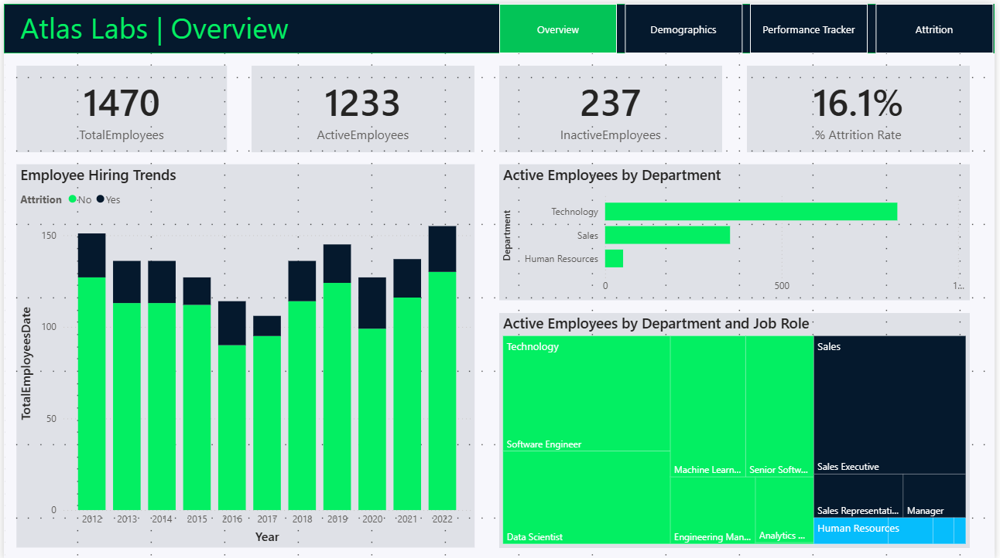
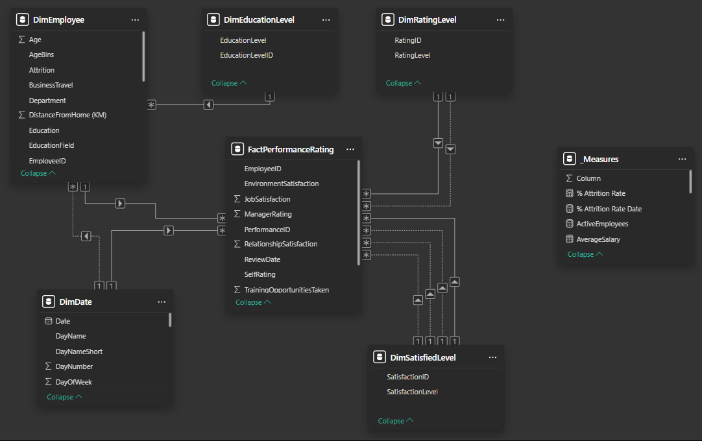
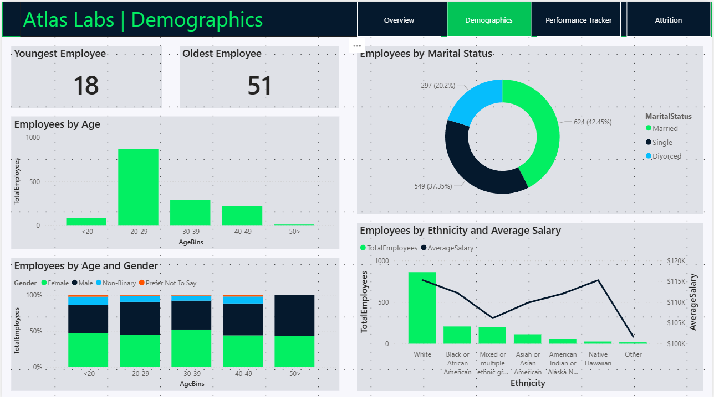
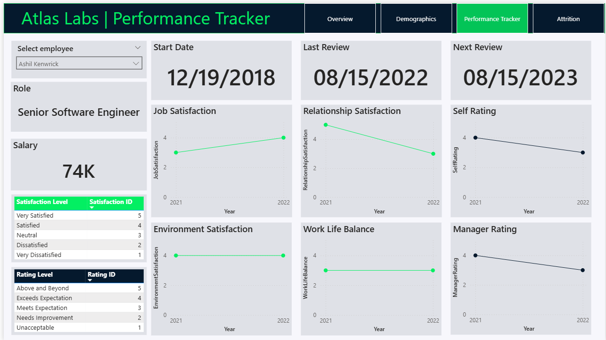
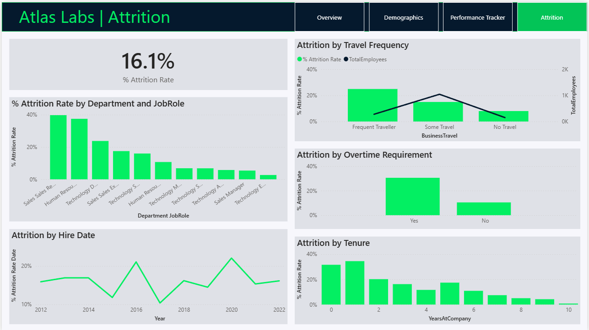

# 📌 Atlas Labs – HR Analytics Report (Power BI)  
📊 **Advanced Power BI Project | Employee Attrition | Performance Tracker | Multi-Table Data Model**  
🌐 **[🔗 View Live Dashboard (Power BI Web)](https://app.powerbi.com/view?r=eyJrIjoiNDllNGYxZWEtNGZlNS00N2UwLWE1YzEtMGY5NzcwZWU5OWFlIiwidCI6IjY3NDM4ODYzLThjOTItNGQ0ZC1iMjAyLTIzNmZjMjNhZDk2MCIsImMiOjl9&pageName=ReportSection)**  

    <b>Dashboard Overview</b>  
     
    

---

## 🔍 Project Overview  
This Power BI project delivers **strategic HR insights** for a **fictional company (Atlas Labs)**, transforming employee data into **actionable workforce intelligence** through an interactive, multi-page dashboard.

### 🚀 Key Objectives  
✅ Provide **HR managers** with interactive, real-time analytics  
✅ **Identify** key factors contributing to **employee attrition**  
✅ Monitor **individual performance** and satisfaction trends  
✅ Deliver **executive-ready visuals** powered by advanced DAX measures  

---

## 📂 Dataset & Data Modeling  
🔹 **Multi-Table Dataset** covering **Employees, Performance Reviews, Education Levels, Ratings, and Dates**  
🔹 **Star Schema** with clean **one-to-many relationships** between fact and dimensions  
🔹 **Key Transformations:**  
   - ✅ Created **Age Bins** for demographic segmentation  
   - ✅ Mapped **ratings and satisfaction levels** to readable categories  
   - ✅ Built custom **DAX measures** for attrition rate, active employee count, and average salary  

    <b>Data Model</b>  
     
    

---

## 📊 Power BI Features & Techniques Used  
### 🔹 1. Multi-Page Interactive Dashboard  
✅ **Overview Page:** Total employees, attrition %, hiring trends, and active workforce  
✅ **Demographics Page:** Insights by age, gender, marital status, and ethnicity  
✅ **Performance Tracker Page:** Detailed view of satisfaction & ratings for selected employees  
✅ **Attrition Page:** Breakdown of turnover by tenure, department, overtime, and hire date  

### 🔹 2. Advanced Power BI Features  
✅ **Dynamic Page Navigation** – Seamless switching using bookmarks  
✅ **Slicer Interactivity** – Filter views by department, gender, or job role  
✅ **Time-Based Trend Charts** – Track review scores year-over-year  
✅ **Dual-Axis & Combo Visuals** – Blend metrics like count vs. salary or attrition %

    <b>Demographics Page</b>  
     
    

    <b>Performance Tracker Page</b>  
     
    

    <b>Attrition Page</b>  
     
    

---

## 📈 Key Insights & Business Value  
🔹 **Attrition Drivers:** Highest turnover in Sales & HR, especially with frequent travel or overtime  
🔹 **Demographic Trends:** 20–29 age group forms the core workforce  
🔹 **Diversity Check:** Ethnic representation is varied, but some gaps in salary equity  
🔹 **Performance Drops:** Some employees show declining satisfaction over time  

---

## 🛠️ How to Use the Dashboard  
1️⃣ **Download the `.pbix` file** and open it in Power BI Desktop  
2️⃣ **Use the sidebar** to switch between insights pages  
3️⃣ **Click filters or employee dropdowns** to explore deeper insights  

👉 **[📥 Download Full Power BI Report (.pbix)](https://github.com/shareef99997/Atlas-Lab-HR-Project/raw/refs/heads/main/Atlas%20Labs.pbix)**  

---

## 💡 Why This Project Stands Out  
🚀 **Not Just Another HR Dashboard!**  
✅ **Individual Performance Tracker** – Visual timeline of satisfaction ratings  
✅ **Attrition Deep Dive** – Breakdown by role, travel, tenure, and more  
✅ **Multi-Layered Relationships** – Built for SQL-based expansion  
✅ **Advanced DAX Measures** – Powerful KPIs, segmentation, and HR intelligence  

---

## 👨‍💻 About Me  
Hi, I'm **Shareef Ali**, a passionate **Data Analyst** with expertise in **Power BI, SQL, and Python**.  

📬 **Let’s connect!** Check out my other projects or reach out:  

🔗 **[GitHub Portfolio](https://github.com/shareef99997)**  
🔗 **[LinkedIn](https://www.linkedin.com/in/shareef-ali/)**  
🔗 **[Personal Website](https://www.shareefdev.com)**  

📢 **If you find this project valuable, give it a ⭐ on GitHub!** ⭐  
